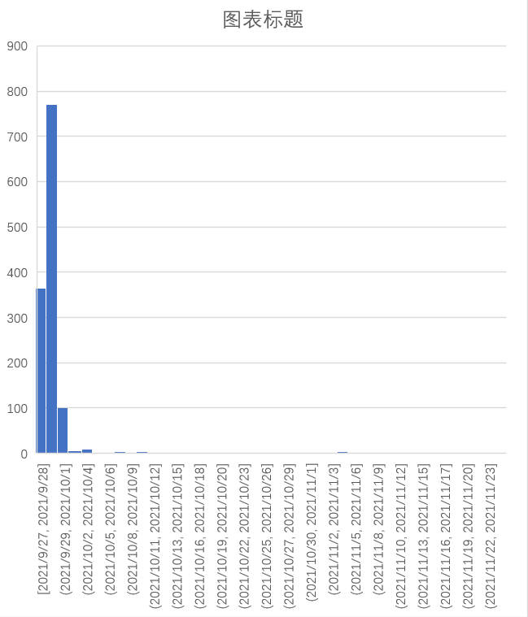

# zhihuspider_plus_wordcloud_plus_emotional_analysis
【说明】：有一门选修课需要做presentation，我们小组选择了孟晚舟回国这件事作为主题，我负责写代码和做一些浅薄的数据分析，我的代码借鉴和复制粘贴了许多开源项目和社区的开源代码，所以这个仓库只是用作于我个人学习笔记，不要随便搬走代码，那是在冒犯别的作者

其中，知乎爬虫终极版基本都是照搬开源社区的代码，无停用词处理，原代码在做完分词后直接按步长为5(或者10)截取分词，于是我重写了知乎爬虫+词云低配版升级版plus（有停用词处理），大部分是靠自己写的，有停用词处理，以一个版本还可以为词云添加地图背景。停用词处理和情感分析的代码来源于github的《计算传播学导论》附上链接（https://github.com/SocratesAcademy/ccrbook）， 事实上我修改了情感词的文本，用来适应我研究的课题。

终极版和升级版或者其他的版本次序最大的是实实在在可以运行的代码，其他的代码都有bug，我保留它们是为了看到我的学习过程，多么的缓慢，犯了哪些错误。

孟晚舟回国话题知乎数据分析

一、 时间线梳理：
 
 
 
二、起因、经过结果：

放视频

三、针对孟晚舟回国事件在知乎话题中的时间热度、内容选取、标题等进行数据分析

1、在筛查知乎有关孟晚舟回国话题时，我发现一个有趣的现象，在排名靠前的话题中，信息熵往往较大，这些文章普遍政治立场正确，强调祖国强大，批评加拿大和美国的做法，话术千篇一律，毫无重点。而逻辑清晰、结合事件发展和国内外情况进行理性分析的文章往往排名并不占领高地。由信息熵的计算公式知，信息熵较大时往往不能得到我们想要的结果。

于是我选择了信息熵较小的知乎问答板块进行数据分析。
下面这张图是孟晚舟回国知乎问答综合排名前10话题关键字：

 
 
从词云中可以看出，除了“孟晚舟回国”这五个字之外，“祖国”、“强大”、“对华”等关键字也具有较高的频率，“祖国”、“强大”等关键字表明话题政治立场正确，“对华”等关键字涉及中国与加拿大和美国的外交。
下图是对这十个问题进行情感分析的结果：

 
 
结果表明，消极情绪话题要多于积极情绪话题。我检查了代码中消极情绪的判断方式，发现消极文本把一些中性词语也归入了消极词语的文本，也就是说，对于这个结果，应该理解为非积极情绪话题要多于积极情绪话题，这印证了知乎问答板块的信息熵较小的特点，即知乎问答板块的信息更为有效。

2、在此基础上，我爬取了知乎高赞问答的4000份左右的observation，并制作了词云
如下图所示：

知乎高讨论度问题“孟晚舟回国与祖国强大”的回答高频词：

 
 
知乎高讨论度问题“孟晚舟回国对华为影响”的回答高频词：

 
 
从词云中不难看出针对不同的话题，高频词也不尽相同。比如在于国家强大相关的话题中政治立场更为鲜明。而在与华为影响相关的问题中，回答的视野更加开阔，更多的人从国际角度、因果逻辑层面看待问题
为了了解回答者的情感倾向，我对第一个问题下所有的讨论进行情感分析，如下图所示，

结果是积极回答的百分比为百分百，消极回答为0，这显然是不合理的。所以当我回溯回答的积极分值和消极分值的时候，发现有部分回答的积极分值和消极分值相差并不大，但是依然会被判定为积极情绪，所以我添加了一个全讨论情绪分析，整合了所有讨论的积极分值和消极分值，如下图所示

 
 
 
3、同时，为了研究话题的时间热度变化，我制作了可视化图表，如下图所示：。
结果显示第二个话题在9月25日讨论度最高，第一个话题在9月28至9月29日讨论热度到达高潮，之后热度一直下跌，结合孟晚舟事件发展的时间轴可知，9月25日是孟晚舟回国的时候，9月27日是外交部发言称孟晚舟事件是一起针对中国公民的政治迫害事件，目的是打压中国的高技术企业。从热度变化的趋势可以看出，总体上网友对话题的只保持非常短暂的新鲜感。

 
 
 
 
